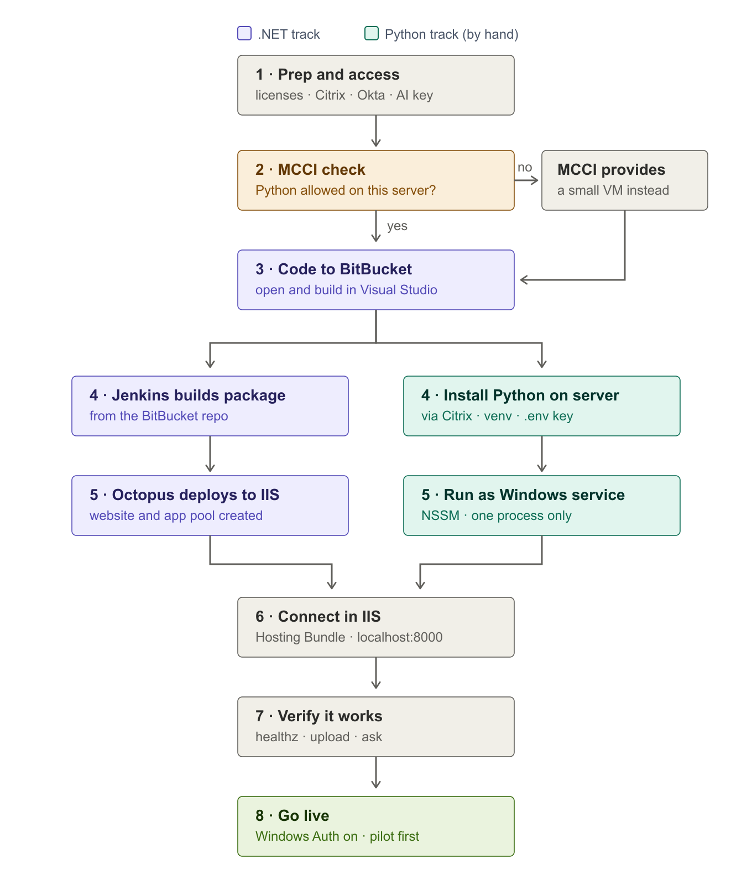

# Implementation Guide (for beginners) — Chat with Data, In-RAM Edition

> Read the "Big picture" and "Honest heads-up" sections first — they save confusion.

**The road to go-live at a glance** (each numbered box maps to a section below):



---

## 0. The big picture (what you are deploying)

This app is **two programs that run on ONE server** and talk to each other:

```
   Users' browsers
         │  (company network)
         ▼
   ┌─────────────────────────────────────────────┐
   │  ONE Windows server                          │
   │                                              │
   │   .NET app  ──localhost──►  Python service   │
   │   (users see this)          (does the AI work,│
   │   hosted by IIS)            holds data in RAM) │
   └─────────────────────────────────────────────┘
         │
         ▼
   GA "LiteLLM" AI gateway (the AI model)
```

1. **The .NET app** is the website users open. It shows the screens, handles login,
   and passes questions to the Python service. It is a normal ASP.NET Core (.NET 8)
   web app, so it fits your MCCI pipeline.
2. **The Python service** does the actual data analysis and talks to the AI gateway.
   It keeps each user's uploaded file and conversation **in the server's memory
   (RAM)** so follow-up questions are fast. It listens only on the server itself
   (localhost), so users never talk to it directly.

Both run on the **same one server** ("Option 1 / in-RAM"). No database, no file
share, no load balancer.

---

## 1. Honest heads-up (read this)

Your MCCI pipeline (Jenkins/Octopus) is built for **.NET** apps. The **.NET part of
this app fits perfectly.** The **Python part does not fit the standard pipeline** —
it is installed on the server "by hand" (or with a small Octopus script). This is
normal for a hybrid app, but it means:

- You will need permission to **install Python** on the server and **run it as a
  Windows service**. Confirm this is allowed **before** you start.
- Involve the **MCCI / BPS team early** and tell them: "It's a .NET web app **plus** a
  Python helper service on the same server." They set up Jenkins + Octopus + IIS;
  you handle the Python service with this guide.

If installing Python on the IIS server is not permitted, stop and ask the MCCI team
how they'd prefer to host a Python process (a small separate VM is the usual answer).

---

## 2. The tools, in plain English

| Tool | What it is | Your job with it |
|------|------------|------------------|
| **Visual Studio** | The program you write/open .NET code in | Open the project, make sure it builds |
| **BitBucket** (bitbucket.ga.com) | Company "Git" — where the code lives | Put the code here so Jenkins can find it |
| **Jenkins** (mccijenkins.ga.com) | Robot that **builds/packages** the code | Create a build job (MCCI team helps) |
| **Octopus** (mccioctopus.ga.com) | Robot that **deploys** the package to a server | Create a deploy project to IIS (MCCI team helps) |
| **IIS** | Microsoft's **web server** on the Windows box | Hosts the .NET app so users can reach it |
| **Citrix** (xendesktop.ga.com) | Remote access to the **server desktop** | Log into the server to set up Python |
| **Centrify / Okta** | Elevated-access login + phone MFA | Get admin rights on the server when needed |

---

## 3. Before you start — accounts & access checklist

Tick these off first (ask IT/MCCI for anything you don't have):

- [ ] **Visual Studio Professional** license (~$1200/yr) installed on your PC.
- [ ] **BitBucket** license (~$48/yr) and a login at bitbucket.ga.com.
- [ ] **"Developer-High" policy** on your computer (lets you develop).
- [ ] Access to **Jenkins**, **Octopus**, and **Citrix**.
- [ ] **Centrify** OAuth set up and an **Okta OTP** on your phone (for elevated/admin
      actions on the server).
- [ ] The **target Windows server** identified, and permission to install software
      and create a Windows service on it.
- [ ] The **AI gateway key** (`LITELLM_API_KEY`) from whoever manages the GA LiteLLM
      gateway, and confirmation the server can reach `https://aigateway.ga.com`.
- [ ] The code (currently in GitHub) — you will copy it into **BitBucket** (Section 4).

---

## 4. Part A — Put the code in BitBucket and open it in Visual Studio

The code is in GitHub today; the company standard is BitBucket.

1. In a browser, go to **bitbucket.ga.com** and **Create repository** →
   name it `chat-with-data-RAM` (or as MCCI advises). Copy the new repo's URL.
2. On your PC, get the code and push it to BitBucket. In a terminal:
   ```
   git clone https://github.com/thiagoalvares/chat-with-data-RAM
   cd chat-with-data-RAM
   git remote set-url origin <the-BitBucket-URL-you-copied>
   git push -u origin main
   ```
   (If your company only allows BitBucket, ask MCCI whether GitHub access is fine for
   this one-time copy, or they can help mirror it.)
3. Open **Visual Studio** → **Open a project** → open the `dotnet-app` folder's
   `ChatWithData.Web.csproj`.
4. Press **Build** (or Ctrl+Shift+B). It should say **Build succeeded**. This confirms
   the .NET app is healthy before deployment.
   - Note: this is an ASP.NET Core **.NET 8** web app (it serves the UI as static
     files and proxies to Python). It deploys to IIS exactly like a Razor Pages app.

---

## 5. Part B — Build & deploy the .NET app (Jenkins → Octopus → IIS)

This is the standard MCCI flow. **Ask the BPS/MCCI team to help wire these** — you
provide the BitBucket repo; they configure the robots. In plain terms:

1. **Jenkins (build):** create a build job pointed at your BitBucket repo. It runs
   the equivalent of `dotnet publish -c Release` on the `dotnet-app` project and
   produces a deployable package. (The MCCI team has templates for .NET 8.)
2. **Octopus (deploy):** create a deploy project that takes that package and installs
   it to **IIS** on the target server — this creates the website and its "app pool".
3. On the server, IIS now hosts the .NET app. Two settings matter (Section 7 covers
   how): the app must run as **Production**, and it must know Python is at
   **localhost:8000** (already set in `appsettings.Production.json`).

> If you are not ready to wire Jenkins/Octopus yet, you can do a **manual first
> deploy** to prove it works: in Visual Studio, right-click the project → **Publish**
> → **Folder**, copy the published folder to the server, and point an IIS site at it
> (Section 7). Use the pipeline for the real, repeatable deployments.

---

## 6. Part C — Set up the Python service on the server (by hand)

Log into the **server** using **Citrix**. Do the following **on the server**.

### 6.1 Install Python
1. Install **Python 3.10 or newer** (from python.org or your company Software Center).
2. During install, **check "Add Python to PATH."**
3. Verify: open **PowerShell** and run `python --version` → it should print a version.

### 6.2 Get the code onto the server
Copy the **`python-service`** folder to the server, e.g. to
`C:\apps\chat-with-data\python-service`. (You can clone from BitBucket, or use the
package Octopus deployed, or copy it over.)

### 6.3 Install the Python app
In **PowerShell**, in that folder:
```
cd C:\apps\chat-with-data\python-service
python -m venv .venv
.\.venv\Scripts\activate
pip install -r requirements.txt
```
This creates an isolated environment and installs everything the service needs
(including **waitress**, the web server it runs under).

### 6.4 Create the configuration file
```
copy .env.example .env
notepad .env
```
In Notepad, set at least these, then save:
```
LITELLM_API_KEY=<the key you were given>
LITELLM_API_BASE=https://aigateway.ga.com
STORAGE_BACKEND=memory
SERVICE_PORT=8000
```
`STORAGE_BACKEND=memory` is what makes it hold everything in RAM.

### 6.5 Test it runs
```
python serve.py
```
You should see: `waitress on http://127.0.0.1:8000 ... single process`. Leave it a
moment, then open another PowerShell and run:
```
curl http://localhost:8000/health
```
It should return `{"ok": true, ...}`. Press **Ctrl+C** in the first window to stop it.

### 6.6 Make it run automatically as a Windows service (NSSM)
So it starts on boot and restarts if it crashes:
1. Download **NSSM** (nssm.cc) and unzip it on the server.
2. In an **Administrator** PowerShell:
   ```
   nssm install ChatWithDataPython
   ```
   In the window that opens, set:
   - **Path:** `C:\apps\chat-with-data\python-service\.venv\Scripts\python.exe`
   - **Startup directory:** `C:\apps\chat-with-data\python-service`
   - **Arguments:** `serve.py`
   - (Optional) **Environment** tab: add `SERVICE_PORT=8000`
   Click **Install service**, then start it:
   ```
   nssm start ChatWithDataPython
   ```
3. Confirm again: `curl http://localhost:8000/health`.

> ⚠️ **Never run more than one Python process/worker for this edition.** All the
> in-RAM sessions live in one process; a second one would "lose" users' data
> randomly. One service, one process — that's the design.

---

## 7. Part D — Configure IIS and connect the two pieces

On the **server** (via Citrix), as an admin:

1. **Install the .NET 8 Hosting Bundle** (from Microsoft). This teaches IIS how to run
   ASP.NET Core apps. After installing, run `iisreset` in an admin PowerShell.
2. Open **IIS Manager**. Find the website Octopus created (or create one pointing at
   the published .NET folder). Its **Application Pool** should have **.NET CLR
   version = "No Managed Code"** (ASP.NET Core runs its own runtime).
3. Tell the app it's Production: set the environment variable
   **`ASPNETCORE_ENVIRONMENT = Production`** for the site/app pool (the MCCI/Octopus
   template usually does this; if not, set it in the app pool's advanced settings or
   a `web.config` env variable).
4. Confirm **`appsettings.Production.json`** has
   `"PythonService": { "BaseUrl": "http://localhost:8000" }` — it already does in this
   repo. This is how .NET finds the Python service on the same box.
5. **Login (Windows Authentication):**
   - For your **first smoke test**, you can turn login OFF to keep things simple:
     in `appsettings.Production.json` set `"Auth": { "Enabled": false }`, redeploy.
   - For the **real go-live**, set `"Auth": { "Enabled": true }`, make sure the server
     is **domain-joined**, and in IIS enable **Windows Authentication** and disable
     **Anonymous Authentication** for the site. Users will then sign in with their
     GA/Active Directory account automatically.
6. In IIS, note the site's URL/binding (e.g. `http://theserver` or a hostname). That's
   the address users will visit.

---

## 8. Part E — Verify it works

1. Make sure the Python service is running (`curl http://localhost:8000/health` → ok).
2. On a PC on the company network, open the app URL in a browser.
3. Open **`<app-url>/healthz`** — it should show **both** layers OK, e.g.
   `{"dotnet":"ok","python":{"ok":true,...}}`.
4. In the app: upload a small CSV/Excel, ask a question (e.g. "total by region"), and
   confirm you get an answer (and a chart). Ask a **follow-up** — it should be fast
   because the data is held in RAM.

If the app loads but answers fail, it's almost always the **AI gateway**: the server
can't reach `aigateway.ga.com`, or the key in `.env` is wrong. See Troubleshooting.

---

## 9. DEV / QA / PROD — how environments work with these tools

**The idea:** environments are separate servers running the **same app** with
**different settings**. You never build three versions — Jenkins builds the
package **once**, and **Octopus promotes that same package** from one
environment to the next.

```
BitBucket ──► Jenkins (build v1.0.3 ONCE) ──► Octopus
                                                │ deploy
                                                ▼
                                          DEV server        env = Development, auth off
                                                │ promote
                                                ▼
                                          QA server         env = QA, testers verify
                                                │ promote
                                                ▼
                                          PROD server       env = Production, Windows Auth, real users
```

### 9.1 Who does what
- **Jenkins** builds one versioned package from BitBucket.
- **Octopus** holds the list of environments (its "lifecycle": DEV → QA → PROD)
  and the per-environment variables. Deploying to QA and later PROD is a
  button click ("Promote") — same package, different settings applied.
- **IIS** on each server hosts that environment's copy of the .NET app.

### 9.2 How the settings switch per environment (.NET — automatic)
The repo already contains one settings file per environment:
`appsettings.Development.json`, `appsettings.QA.json`, `appsettings.Production.json`.
Octopus sets a single environment variable on each server —
**`ASPNETCORE_ENVIRONMENT`** = `Development`, `QA`, or `Production` — and the app
automatically loads the matching file. That is the whole mechanism. In this
edition all three point Python at `http://localhost:8000` (Python always runs on
the same box); what changes is logging and whether Windows Authentication is on
(off in Development, on in QA and Production).

### 9.3 The Python service per environment (manual, once per server)
Python sits outside the Jenkins/Octopus pipeline, so **repeat the Section 6
setup on each environment's server** (QA server, PROD server). Each gets its own
`.env` file — same layout, potentially different values (e.g. a test vs.
production AI-gateway key). It is the same ~20 minutes of work per server, done
once; after that, code updates to Python are a copy + service restart (or a
small Octopus script step the MCCI team can add later).

### 9.4 What this looks like day-to-day
1. You change code on **your PC** (your personal DEV) and push to BitBucket.
2. Jenkins builds package `1.0.x`.
3. Octopus deploys it to **QA** → you/testers upload a file, ask questions, export.
4. Happy? Click **Promote to PROD** — the identical package goes live.
5. Next fix: push → build `1.0.x+1` → QA → promote. Repeat.

> **Tip:** many small apps skip a dedicated DEV *server* (your PC plays that
> role) and run just **QA + PROD** servers. Ask the MCCI team what their
> standard is — it's question 11 in the list below.

## 10. Troubleshooting (common first-time issues)

| Symptom | Likely cause & fix |
|---|---|
| Browser shows **HTTP 502.5** or the .NET site won't start | The **.NET 8 Hosting Bundle** isn't installed, or the app pool isn't "No Managed Code". Install the bundle, run `iisreset`. |
| App loads but **questions return an error** | The server can't reach the **AI gateway**, or `LITELLM_API_KEY` is wrong/empty in `python-service\.env`. Fix the key; confirm network access to `aigateway.ga.com`. |
| `/healthz` shows **python: unreachable** | The Python service isn't running. Start it: `nssm start ChatWithDataPython`, then `curl http://localhost:8000/health`. |
| **Everyone's data seems to mix up / disappear** | You are running **more than one** Python process/worker. Run exactly one (one NSSM service, `serve.py` — do not add workers). |
| **Sessions vanish after a restart** | Expected for the in-RAM edition — users re-upload. Nothing is saved to disk by design. |
| A downloaded **.docx/.pdf won't open** ("corrupt") | Unrelated to the app — it's Git mangling binaries on Windows. This repo now has a `.gitattributes` fix; re-clone, or download the file from the web page / email it to yourself. |
| **Port 8000 already in use** | Something else uses 8000. Change `SERVICE_PORT` in `.env` and `BaseUrl` in `appsettings.Production.json` to match. |

---

## 11. Who does what (hand-offs)

- **You:** copy code to BitBucket, confirm it builds in Visual Studio, set up the
  Python service (Section 6), configure IIS settings (Section 7), and test.
- **MCCI / BPS team:** set up the **Jenkins** build and **Octopus** deploy, and help
  with IIS site creation and server permissions. **Tell them early about the Python
  service** so they can advise on hosting/permissions.
- **Whoever owns the AI gateway:** gives you the `LITELLM_API_KEY` and confirms the
  server can reach it.

---

## 12. Questions to ask the MCCI team (copy-paste this)

Send this list to the MCCI/BPS team before you start — the answers decide the
few open choices in this deployment:

1. We are deploying an ASP.NET Core (.NET 8) web app **plus a Python helper
   service on the same server**. Is installing **Python 3.10+** on the IIS server
   allowed? If not, can you provide a small VM (or your preferred host) for it?
2. May we run the Python service as a **Windows service** (we'd use NSSM, or your
   preferred wrapper)? Who has admin rights to set that up?
3. Which **Windows server** will host the app, and what is its URL/hostname for
   users? Is it **domain-joined** (needed for Windows Authentication)?
4. Can you help create the **Jenkins build job** (dotnet publish of the
   `dotnet-app` project from our BitBucket repo) and the **Octopus deploy
   project** to IIS? Do you have a standard .NET 8 template we should follow?
5. Does the standard Octopus/IIS template set **`ASPNETCORE_ENVIRONMENT=Production`**
   and install the **.NET 8 Hosting Bundle**, or do we handle those?
6. The server needs **outbound HTTPS to `https://aigateway.ga.com`** (our internal
   AI gateway). Is that open from the target server, or does it need a firewall
   request?
7. Where should we keep the AI gateway **API key** on the server — is a
   restricted `.env` file acceptable, or is there a required secrets store?
8. For go-live we plan **Windows Authentication** (Active Directory) on the IIS
   site. Any standard steps on your side (service account, SPN, site bindings)?
9. Is there anything about **BitBucket repo naming/permissions** or branch policy
   we should follow so Jenkins picks it up cleanly?
10. Who is the right contact for **post-go-live** server issues (restarts,
    monitoring, patching windows)? Restarting the Python service clears active
    user sessions, so we'd like restarts scheduled off-hours.
11. How many **environments** do we get for an app like this — dedicated DEV, QA,
    and PROD servers, or just QA + PROD (with the developer PC as DEV)? And is the
    Octopus lifecycle DEV → QA → PROD already templated?

---

## 13. One-page cheat sheet

**Servers/ports**
- .NET app: hosted by **IIS** (users' URL).
- Python service: **http://localhost:8000** (server-only), run by NSSM.
- AI gateway: **https://aigateway.ga.com** (outbound).

**Key files**
- `dotnet-app/appsettings.Production.json` — `PythonService:BaseUrl` (localhost:8000)
  and `Auth:Enabled`.
- `python-service/.env` — `LITELLM_API_KEY`, `LITELLM_API_BASE`, `STORAGE_BACKEND=memory`.
- `python-service/serve.py` — the command the Windows service runs.

**Handy commands (on the server)**
```
# start / stop the Python service
nssm start ChatWithDataPython
nssm stop  ChatWithDataPython

# health checks
curl http://localhost:8000/health          # Python only
# open <app-url>/healthz in a browser        # both layers

# reset IIS after installing the Hosting Bundle
iisreset
```

**Remember**
- One server, one Python process, everything in RAM.
- Restart clears sessions (users re-upload) — fine for a small user base.
- To grow beyond one server later, switch to the `chat-with-data-dotnet` edition
  (adds SQL Server + file share + load balancer).
